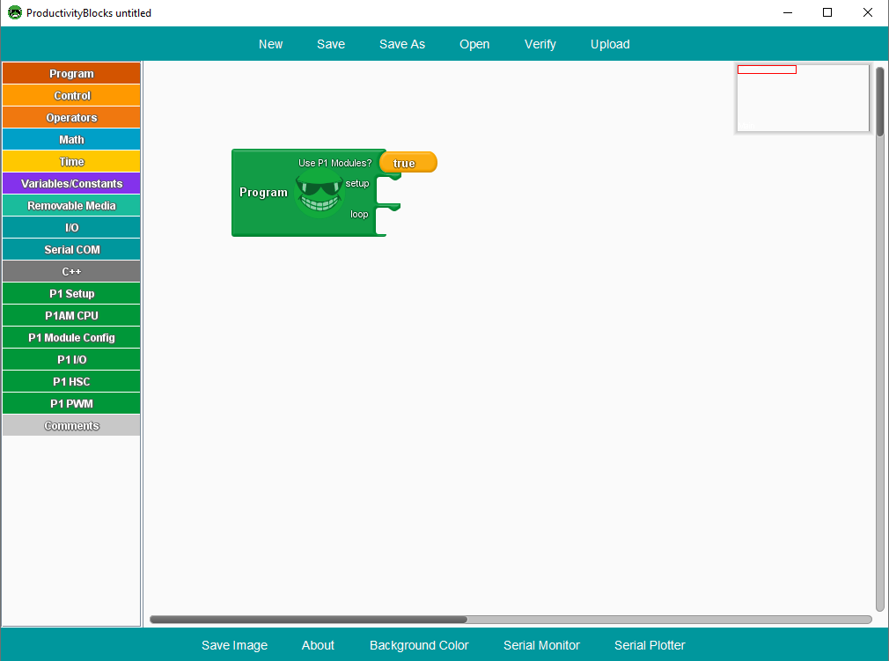
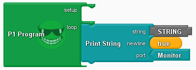
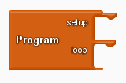
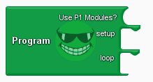
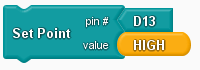
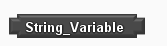
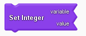

# ProductivityBlocks

ProductivityBlocks is an open source block programming tool for the [Arduino Editor](http://www.arduino.cc/en/Main/Software). The application is designed to work with the [P1AM-100 library](https://github.com/facts-engineering/P1AM) to program a P1AM CPU. 

## Installation
Before installing ProductivityBlocks, please install the [Arduino Editor](https://www.arduino.cc/en/Main/Software).
ProductivityBlocks is a tool for the Arduino software, and will not work properly unless the Arduino software is installed.

### Windows:

1. Download the latest ProductivityBlocks installer for Windows from the [Releases](https://github.com/adcpblocks/ProductivityBlocks/releases).
2. Close any Arduino Editor windows.

    

3. Run the installer as an administrator.

    
3. Open/reopen the Arduino Editor and check for ProductivityBlocks in the tools menu.

    

# Getting Started

ProductivityBlocks is a graphical block programming tool that writes c++ code to the Arduino software. 

Each block represents a piece of a program that will run on Arduino CPUs.
To create a program, use the tabs on the left side of the application to select a block category: 

Then click and drag the desired block into the main canvas: 

Blocks snap into place when dragged close enough to a connector with the right shape.

Once a block program has been created, click the 'Verify' button to check the generated c++ code:

When the program is ready, use the 'Upload' button to push the program to a connected Arduino board.

# Basic Block Programming

Each block represents a piece of a full program. There a few special blocks that represent the full c++ program:

**Loop**

**Program**

**P1 Program**

Block programs may only have one of these blocks in the main canvas, otherwise the program will not be able to verify or compile. After placing one of these blocks on the main canvas, the program can be created by snapping new blocks onto its connectors. 

## Basic Block Types

There are four different kinds of blocks:
-**Program**: Contains the c++ program to be loaded onto an Arduino board (as described above).

-**Command**: An operation to be done in the program.

 

-**Function**: An operation that returns a value to be used in the program.

 

-**Data**: Variables and constants.

   

## Data Types

There are 5 different basic data types in ProductivityBlocks:

-**Integer**
-**Long Integer**
-**Boolean**
-**Character**
-**String** 

Each type has a variable block to go with it. Variables can have a user-defined name and can be set using the ‘set variable’ blocks:

