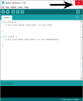
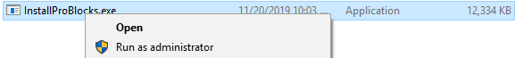
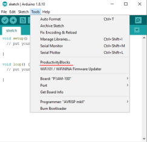

# ProductivityBlocks

ProductivityBlocks is an open source block programming tool for the [Arduino Editor](http://www.arduino.cc/en/Main/Software). The application is designed to work with the [P1AM-100 library](https://github.com/facts-engineering/P1AM) to program a P1AM CPU, but it may also be used to program other Arduino boards supported by the Arduino Editor.

ProductivityBlocks is based on the [ardublock](https://github.com/taweili/ardublock) project.
## Installation
Before installing ProductivityBlocks, please install the [Arduino Editor](https://www.arduino.cc/en/Main/Software).
ProductivityBlocks is a tool for the Arduino Editor, and will not work properly unless the editor is installed.

### Windows:

1. Download the latest ProductivityBlocks installer for Windows from the [Releases](https://github.com/adcpblocks/ProductivityBlocks/releases).
2. Close any Arduino Editor windows.

    

3. Run the installer as an administrator.

    

3. Open/reopen the Arduino Editor and check for ProductivityBlocks in the tools menu.

    

### Mac:

1. Download the latest ProductivityBlocks installer for Mac from the [Releases](https://github.com/adcpblocks/ProductivityBlocks/releases).

2. If you have the Arduino Editor running, right click the icon and 'quit' the program.

3. Run the installer.

4. Open/reopen the Arduino Editor and check for ProductivityBlocks in the tools menu.

## Documentation:
To learn about programming in ProductivityBlocks, visit the [ProductivityBlocks Wiki](https://github.com/AutomationDirect/ProductivityBlocks/wiki).
