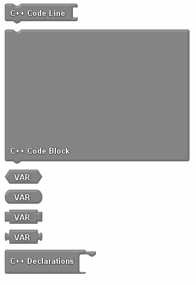
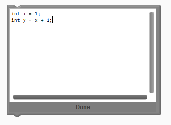

# C++ Code Blocks

----
## Description
These blocks allow you to inject your own C++ code into your block program.

----
## Usage
Use the 'C++ Code Block' and 'C++ Code Line' blocks to write C++ code directly into your block program. When ProductivityBlocks generates code in the Arduino Sketch using the 'verify' or 'upload' buttons, these blocks will put the text they contain into the Sketch. 

The 'VAR' blocks above are used to reference variables that are created with C++ Code Blocks:

The 'C++ Declarations' block provides a way to place code blocks above the 'setup()' and 'loop()' functions in an Arduino Sketch. Only 'C++ Code Block' and 'C++ Code Line' can be placed here.

----
## Notes
* C++ Code Blocks are intended for users who can program with C++ code. Users without programming experience are encouraged to learn basic C++ programming before using.