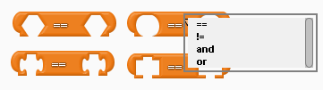

# Comparison Blocks

----
## Description
These blocks return a boolean 'true/false' value comparing two inputs.

----
## Usage
Each comparison block makes a comparison between two values of similar data type. Each comparison block has a drop-down menu to select what kind of comparison to make (see 'Comparison Operators' in the [Arduino Reference](https://www.arduino.cc/reference/en/)). All comparison blocks return a boolean ('true/false') value representing the result of the comparison.

----
## Reference
* See 'Comparison Operators' in the [Arduino Reference](https://www.arduino.cc/reference/en/) for more information.