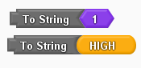

# Convert to String

----
## Description
Create a string from a numeric or a boolean value.

----
## Usage
Returns a string representing the input number/boolean. 

----
## Notes
* The formatting of the converted string is the default 'base ten' (see [String()](https://www.arduino.cc/reference/en/language/variables/data-types/stringobject/)).